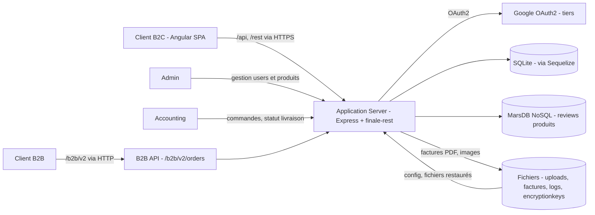

# Threat model - OWASP Juice Shop

## 1. Contexte et biens essentiels

| Bien essentiel                                   | Pourquoi il compte                                                                              | Événement redouté (EBIOS)                                           | Gravité (1 à 4) |
| ------------------------------------------------ | ----------------------------------------------------------------------------------------------- | ------------------------------------------------------------------- | --------------- |
| Comptes clients et administrateurs               | Identité, rôles, mots de passe et profils.                                                       | Usurpation ou fuite de la base `Users`.                             | 4               |
| Jetons JWT, clés RSA et secrets de cookie        | Ils authentifient et signent les utilisateurs.                                                   | Forge de jeton ou détournement de session.                          | 4               |
| Commandes, paniers, prix et statuts de livraison | Ils assurent facturation, stock et confiance client.                                             | Consultation ou modification des données d'un tiers.                | 4               |
| Données personnelles et avis produits            | Profils, adresses, commentaires et achats.                                                       | Divulgation, altération ou publication non autorisée.               | 3               |
| Fichiers publics et internes                     | Uploads, factures, sauvegardes et journaux.                                                      | Lecture sensible ou écriture hors du dossier prévu.                 | 4               |
| Disponibilité de l'application                   | Express, SQLite et les parseurs maintiennent le service.                                        | Indisponibilité par requête ou fichier coûteux.                     | 3               |
| Journaux et métriques                            | Ils servent à détecter et enquêter.                                                              | Action masquée ou fuite d'information opérationnelle.               | 2               |

## 2. Data flow diagram

Trust boundaries identifiées :

- **TB1 — Navigateur <-> serveur applicatif** : requêtes REST, JSON, JWT et fichiers passent par le réseau public. Toute entrée client est hostile et contrôlée côté serveur (`app.ts`, routes Express).
- **TB2 — Serveur applicatif <-> zone de stockage** : le serveur lit et écrit dans SQLite, MarsDB et le système de fichiers (`models/index.ts`, `data/mongodb.ts`, `app.ts`).
- **TB3 — Zone publique <-> back-office** : les fonctions publiques, administratives et comptables partagent le même processus Express. La séparation repose sur `isAuthorized`, `isAccounting` et `denyAll` (`app.ts`, `lib/insecurity.ts`).
- **TB4 — Application <-> Google OAuth2** : Google est un tiers. Redirections, jetons et profils sont exposés au risque ; les flux passent par le navigateur (`frontend/src/app/login/login.component.ts`, `frontend/src/app/oauth/oauth.component.ts`, `frontend/src/app/Services/user.service.ts`).

Profil d'attaquant : un visiteur Internet peut créer un compte, envoyer des requêtes et fichiers,
modifier le client et réutiliser les informations publiques. Il n'a pas d'accès initial au système
de fichiers, au compte Google d'un tiers ni au réseau de supervision.

## 3. Analyse STRIDE

Pour chaque élément ou flux traversant une trust boundary, dérouler les 6 catégories. La priorité vaut **H** (_High_), **M** (_Medium_) ou **L** (_Low_).

| #   | Élément / flux                                                       | Catégorie STRIDE       | Menace concrète                                                                                                   | Exigence de sécurité                                                                                              | Priorité (H/M/L) |
| --- | -------------------------------------------------------------------- | ---------------------- | ----------------------------------------------------------------------------------------------------------------- | ----------------------------------------------------------------------------------------------------------------- | ---------------- |
| 1   | flux client vers API, `/rest/basket/:id` (`routes/basket.ts`)        | Tampering              | `id` client sans contrôle d'appartenance                                                                         | Vérifier que le JWT correspond au propriétaire du panier                                                          | H                |
| 2   | authentification JWT (`lib/insecurity.ts`)                           | Spoofing               | clé RSA de test en dur : un attaquant peut signer un JWT                                                         | Générer, isoler et faire tourner la clé                                                                           | H                |
| 3   | cookies de session (`app.ts`)                                        | Spoofing               | secret `cookie-parser` en dur, identique partout                                                                  | Utiliser un secret aléatoire avec `HttpOnly`, `Secure` et `SameSite`                                             | M                |
| 4   | store SQLite, table `Users` (`models/user.ts`)                       | Information disclosure | mots de passe en MD5 sans sel, cassables après une fuite                                                         | Utiliser Argon2id et migrer les empreintes à la connexion                                                         | H                |
| 5   | réponses HTTP (`app.ts`)                                             | Information disclosure | CORS ouvert et CSP désactivée facilitent l'exfiltration                                                          | Limiter les origines et définir une CSP                                                                           | M                |
| 6   | endpoint `/metrics` (`app.ts`, `routes/metrics.ts`)                  | Information disclosure | métriques publiques révélant l'activité interne                                                                  | Limiter `/metrics` au réseau de supervision ou l'authentifier                                                     | M                |
| 7   | navigation `/ftp`, `/support/logs` (`app.ts`)                        | Information disclosure | `serve-index` révèle fichiers, sauvegardes et journaux                                                          | Désactiver l'indexation et utiliser une liste blanche                                                             | H                |
| 8   | logs applicatifs (`lib/logger.ts`, `logs/`)                          | Repudiation            | pas d'audit durable des actions administratives                                                                  | Journaliser acteur, action, cible, résultat et date dans un stockage protégé                                      | M                |
| 9   | `/rest/user/reset-password` (`app.ts`)                               | Denial of service      | `X-Forwarded-For` peut fausser le rate-limit si le proxy est mal configuré                                      | Définir les proxys de confiance et limiter par IP validée et compte                                               | M                |
| 10  | upload XML B2B `/file-upload` (`routes/fileUpload.ts`, `lib/xml.ts`) | Denial of service      | les entités XML peuvent épuiser CPU ou mémoire                                                                   | Refuser DTD et entités externes, limiter la taille et isoler le parseur                                           | H                |
| 11  | `/api/Users` en POST (`models/user.ts`, `app.ts`)                    | Elevation of privilege | `role` accepté à la création peut créer un compte privilégié                                                     | Ignorer `role`, imposer `customer` et réserver les rôles à l'admin                                                | H                |
| 12  | middleware d'autorisation (`app.ts`, `lib/insecurity.ts`)            | Elevation of privilege | `isAuthorized()` valide le JWT, pas le rôle                                                                      | Vérifier le rôle de chaque route privilégiée et tester les `403`                                                  | H                |

Cible : au moins 10 lignes, couvrant les 6 catégories au moins une fois.

## 4. Correspondance avec EBIOS RM

| Menace STRIDE (ligne) | Événement redouté associé                                    | Scénario de risque (source -> chemin -> impact)                                                                                                          |
| --------------------- | ------------------------------------------------------------ | -------------------------------------------------------------------------------------------------------------------------------------------------------- |
| #1                    | consultation ou altération d'un panier tiers                 | client authentifié -> identifiant de panier modifié dans `/rest/basket/:id` -> fuite de produits, commande frauduleuse ou perte d'intégrité              |
| #2 et #3              | usurpation d'identité                                        | attaquant externe connaissant une clé ou un secret publié -> signature de JWT ou de cookie -> accès sous l'identité d'une victime ou d'un administrateur |
| #4                    | divulgation de la base comptes                               | attaquant obtenant une copie de SQLite -> cassage rapide des empreintes MD5 -> réutilisation de mots de passe et compromission de comptes                |
| #5 à #7               | divulgation de données et reconnaissance de l'infrastructure | origine hostile ou visiteur anonyme -> réponses trop permissives, métriques ou index de répertoires -> exfiltration ou préparation d'une attaque ciblée  |
| #8                    | impossibilité d'attribuer une action sensible                | utilisateur privilégié -> modification sans journal d'audit immuable -> investigation et preuve insuffisantes                                            |
| #9 et #10             | indisponibilité du service                                   | attaquant Internet -> contournement de limite ou XML à entités expansives -> épuisement des ressources du serveur                                        |
| #11 et #12            | élévation de privilège                                       | utilisateur anonyme ou authentifié -> rôle contrôlé par le client ou route protégée seulement par JWT -> accès aux fonctions administratives/comptables  |
